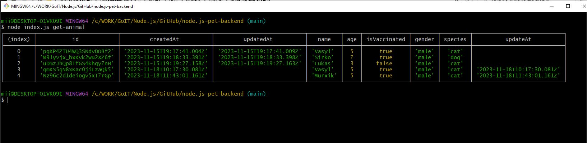
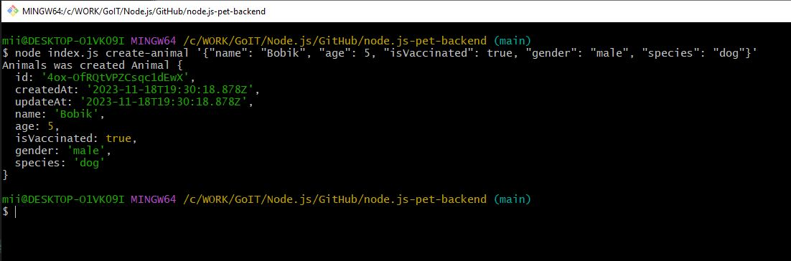
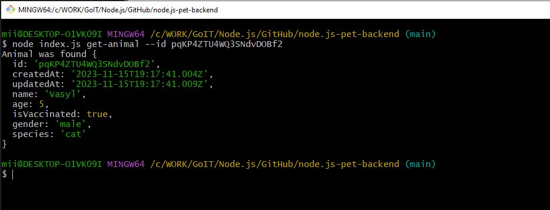

# "Furry friend" application functionality

1. You can add, update, get 1 animal by id
2. You can get multiple animals with pagination and filters
3. You can register as a user. Available roles are Admin, Client
4. The user can create a request for "adoption" of an animal
5. Admin can approve or reject the request. At the same time, the status of the animal changes in the bd
6. You can add photos to animals
7. You can conduct a chat between an administrator and a person who wants to take an animal from the shelter

# Data structure

- id (generated)
- createdAt (timestamp)
- updatedAt (timestamp)
- name (string)
- age (number)
- isVaccinated (boolean)
- gender ('male' | 'female')
- species (string)

### $ node index.js get-animal

### $ node index.js create-animal '{"name": "Vasyl", "age": 5, "isVaccinated": true, "gender": "male", "species": "cat"}'

### $ node index.js get-animal --id pqKP4ZTU4WQ3SNdvDOBf2
